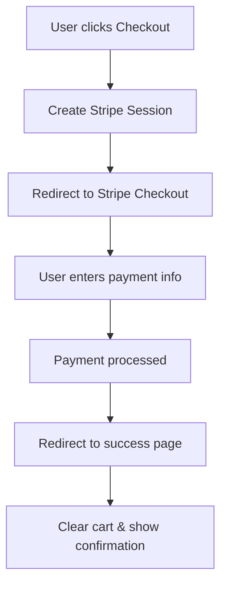

# Stripe Payment Integration Setup Guide

This guide explains how to set up and configure Stripe payment processing for your Full Hundred LLC Next.js application.

## 🎯 **What's Implemented**

### **✅ Core Features**
- **Stripe Checkout Integration**: Secure payment processing
- **Cart Integration**: Seamless checkout from cart page
- **Success Page**: Post-payment confirmation and order details
- **Webhook Handling**: Real-time payment event processing
- **Environment Configuration**: Ready for production deployment

### **✅ Files Created/Modified**
- `src/lib/stripe.ts` - Stripe configuration and utilities
- `src/app/api/stripe/checkout/route.ts` - Checkout session creation
- `src/app/api/stripe/webhook/route.ts` - Payment event handling
- `src/app/checkout/success/page.tsx` - Payment success page
- `src/app/cart/page.tsx` - Updated with Stripe checkout
- `apphosting.yaml` - Added Stripe environment variables

## 🔧 **Setup Instructions**

### **1. Create Stripe Account**
1. Go to [Stripe Dashboard](https://dashboard.stripe.com/)
2. Create a new account or sign in
3. Complete account verification

### **2. Get API Keys**
1. In Stripe Dashboard, go to **Developers > API Keys**
2. Copy your **Publishable Key** (starts with `pk_test_` or `pk_live_`)
3. Copy your **Secret Key** (starts with `sk_test_` or `sk_live_`)

### **3. Set Up Webhooks**
1. In Stripe Dashboard, go to **Developers > Webhooks**
2. Click **Add endpoint**
3. Set endpoint URL to: `https://your-domain.com/api/stripe/webhook`
4. Select events to listen for:
   - `checkout.session.completed`
   - `payment_intent.succeeded`
   - `payment_intent.payment_failed`
5. Copy the **Webhook Secret** (starts with `whsec_`)

### **4. Update Environment Variables**

#### **For Development (.env.local)**
```bash
# Stripe Configuration
STRIPE_SECRET_KEY=sk_test_your_secret_key_here
NEXT_PUBLIC_STRIPE_PUBLISHABLE_KEY=pk_test_your_publishable_key_here
STRIPE_WEBHOOK_SECRET=whsec_your_webhook_secret_here
NEXT_PUBLIC_APP_URL=http://localhost:3000
```

#### **For Production (apphosting.yaml)**
```yaml
- variable: STRIPE_SECRET_KEY
  value: "sk_live_your_live_secret_key_here"
  availability:
    - BUILD
    - RUNTIME
    
- variable: NEXT_PUBLIC_STRIPE_PUBLISHABLE_KEY
  value: "pk_live_your_live_publishable_key_here"
  availability:
    - BUILD
    - RUNTIME
    
- variable: STRIPE_WEBHOOK_SECRET
  value: "whsec_your_webhook_secret_here"
  availability:
    - BUILD
    - RUNTIME
    
- variable: NEXT_PUBLIC_APP_URL
  value: "https://your-production-domain.com"
  availability:
    - BUILD
    - RUNTIME
```

## 🚀 **How It Works**

### **1. Checkout Flow**


### **2. Payment Processing**
1. **Cart Page**: User clicks "Checkout with Stripe"
2. **API Call**: Creates Stripe checkout session
3. **Redirect**: User goes to Stripe's secure checkout
4. **Payment**: User enters card details and pays
5. **Webhook**: Stripe sends payment confirmation
6. **Success**: User redirected to success page with order details

### **3. Security Features**
- **Server-side validation**: All payment processing on server
- **Webhook verification**: Ensures payments are legitimate
- **Environment separation**: Test vs live keys
- **HTTPS required**: All production traffic encrypted

## 💳 **Payment Features**

### **Supported Payment Methods**
- Credit/Debit Cards (Visa, Mastercard, American Express)
- Digital Wallets (Apple Pay, Google Pay)
- Bank transfers (where available)

### **Pricing Model**
- **Labor-only pricing**: All displayed prices are for labor
- **Materials quoted separately**: Discussed during consultation
- **Transparent pricing**: No hidden fees

### **Order Information**
- **Item details**: Name, price, quantity
- **Customer info**: Email, billing address
- **Order tracking**: Session ID for reference
- **Confirmation email**: Sent by Stripe

## 🛠️ **Testing**

### **Test Mode**
- Use test API keys (`pk_test_` and `sk_test_`)
- Use test card numbers from Stripe documentation
- No real money is charged

### **Test Card Numbers**
```
# Successful payments
4242 4242 4242 4242
4000 0566 5566 5556

# Declined payments
4000 0000 0000 0002
4000 0000 0000 9995
```

### **Test Scenarios**
1. **Successful Payment**: Use `4242 4242 4242 4242`
2. **Declined Payment**: Use `4000 0000 0000 0002`
3. **3D Secure**: Use `4000 0025 0000 3155`

## 📊 **Monitoring & Analytics**

### **Stripe Dashboard**
- View all payments and transactions
- Monitor success/failure rates
- Download financial reports
- Manage refunds and disputes

### **Webhook Events**
- `checkout.session.completed`: Payment successful
- `payment_intent.succeeded`: Payment processed
- `payment_intent.payment_failed`: Payment failed

### **Logging**
- All payment events are logged
- Error handling with fallbacks
- Customer support integration

## 🔒 **Security Best Practices**

### **Environment Variables**
- Never commit API keys to version control
- Use different keys for test/production
- Rotate keys regularly

### **Webhook Security**
- Verify webhook signatures
- Use HTTPS endpoints only
- Validate event data

### **Data Protection**
- PCI DSS compliance via Stripe
- No card data stored locally
- Secure token-based payments

## 🚨 **Troubleshooting**

### **Common Issues**

#### **"No checkout URL received"**
- Check Stripe API keys are correct
- Verify environment variables are set
- Check network connectivity

#### **"Invalid signature" webhook error**
- Verify webhook secret is correct
- Check webhook endpoint URL
- Ensure HTTPS is used in production

#### **Payment not processing**
- Check Stripe dashboard for errors
- Verify test/live mode consistency
- Check card details are valid

### **Debug Steps**
1. Check browser console for errors
2. Verify API keys in Stripe dashboard
3. Test with Stripe test cards
4. Check webhook logs in Stripe dashboard

## 📞 **Support**

### **Stripe Support**
- [Stripe Documentation](https://stripe.com/docs)
- [Stripe Support](https://support.stripe.com/)
- [Stripe Community](https://github.com/stripe/stripe-node)

### **Application Support**
- Check logs in Firebase console
- Verify environment variables
- Test with Stripe test mode first

---

## 🎉 **Ready to Go!**

Your Stripe payment integration is now complete and ready for production. The system handles:

- ✅ **Secure payments** via Stripe Checkout
- ✅ **Cart integration** with real-time updates
- ✅ **Order confirmation** with success page
- ✅ **Webhook processing** for payment events
- ✅ **Environment configuration** for deployment
- ✅ **Error handling** and user feedback
- ✅ **Mobile responsive** checkout experience

**Next Steps:**
1. Add your Stripe API keys to the environment variables
2. Test the checkout flow with test cards
3. Set up webhooks in Stripe dashboard
4. Deploy to production with live keys

Happy selling! 🚀
